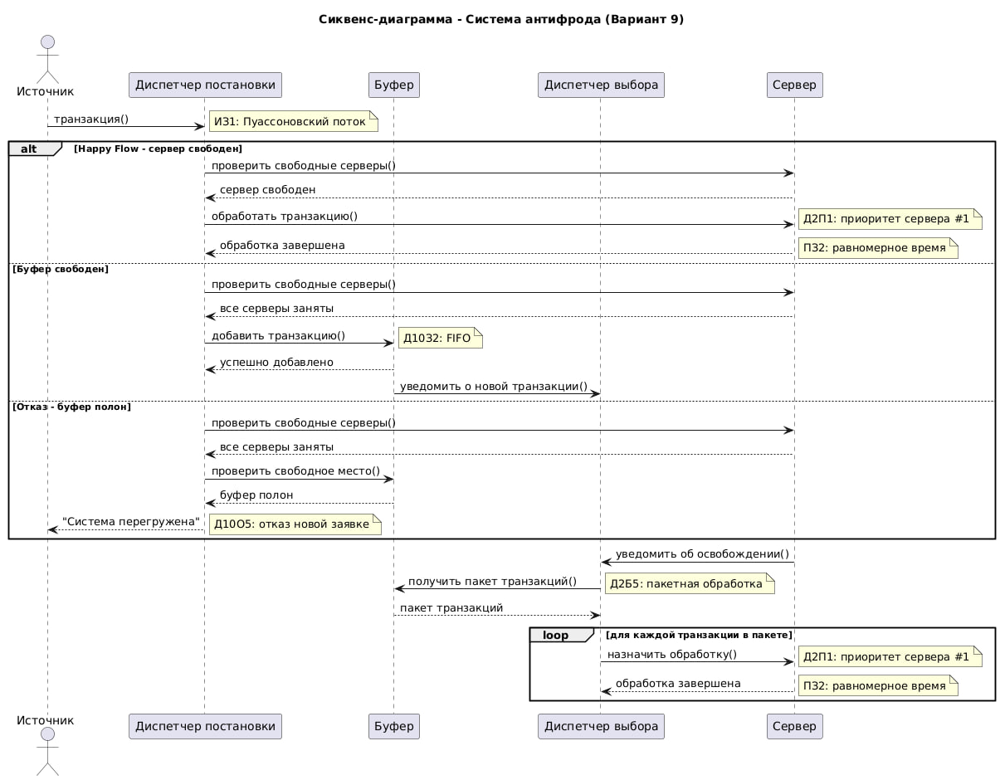

# ASS_wip

Вариант:
ИБ ИЗ1 ПЗ2 Д10З2 Д10О5 Д2П1 Д2Б5 ОР1 ОД3

## **Бизнес-домен** - Система приоритетной верификации транзакций в процессинговом центре банка

Крупный банк обрабатывает тысячи финансовых операций ежедневно. Каждая транзакция должна быть проверена системой антифрода перед окончательным проведением. В периоды пиковой нагрузки (кибератаки, распродажи) система перегружается, и критически важно не пропустить мошеннические операции. Поэтому система обрабатывает транзакции пакетами по приоритету, а при полной загрузке отклоняет новые запросы, чтобы гарантировать качественную проверку уже принятых транзакций.


| Элемент модели | Реализация в бизнес-домене |
|---|---|
| ИБ | Бесконечный поток финансовых транзакций от различных каналов (платежные шлюзы, банкоматы, мобильный банк). |
| ИЗ1 | Пуассоновский закон распределения времени между транзакциями. Транзакции приходят случайным образом, что отражает реальную нагрузку (например, пики в обеденное время или вечером). |
| ПЗ2 | Равномерный закон распределения времени обработки. Время проверки одной транзакции варьируется в заданном диапазоне (напр., от 50 до 200 мс), так как сложность проверки зависит от суммы, типа операции и истории клиента. |
| Д10З2 | Дисциплина буферизации: постановка в буфер в порядке поступления. Транзакции становятся в очередь на проверку строго в том порядке, в котором они поступили в систему. |
| Д10О5 | Дисциплина отказа: отказ вновь пришедшей заявке. В моменты экстремальной нагрузки (кибератака, распродажи) при заполнении всех очередей новые транзакции не принимаются и получают статус «Отклонено. Система перегружена». Обоснование: Целостность и безопасность системы важнее обработки 100% транзакций. Лучше временно отказать, чем пропустить мошенническую операцию из-за недостатка вычислительных ресурсов на глубокий анализ. |
| Д2Б5 | Дисциплина выбора заявки: приоритет по номеру источника с пакетной обработкой. Транзакции динамически группируются по каналу поступления или типу риска (например, «онлайн-платежи», «транзакции по карте»). Когда освобождается сервер, он обрабатывает пакет всех транзакций от самого приоритетного на данный момент источника. |
| Д2П1 | Дисциплина выбора прибора: приоритет по номеру сервера. Сначала транзакции направляются на самый производительный сервер (Сервер I), затем на Сервер 2 и т. д. |
| ОР1 | Автоматический режим: отображение результатов в виде сводной таблицы (вероятность отказа, среднее время пребывания, загрузка серверов). |
| ОД3 | Пошаговый режим: отображение в виде временных диаграмм, визуализирующих процесс поступления, постановки в очередь, пакетной обработки и отказов. |
| Заявка | Финансовая транзакция (платеж, перевод, операция по карте), поступившая от клиента банка через один из каналов (платежный шлюз, банкомат, мобильное приложение), требующая проверки системой антифрода на предмет мошенничества перед ее окончательным проведением. |


## **Артефакты**
Сиквенс-диаграмма


Диаграмма классов


Флоучарт


## **Установка и запуск**

**Требования:**
Python 3.8 или выше,
Стандартная библиотека Python (дополнительные зависимости не требуются)


Клонирование репозитория:
```bash
git clone https://github.com/dr0nych2/ASS-transaction-verification-system.git
cd ASS-transaction-verification-system
```

Проверка структуры проекта:
```text
ASS-transaction-verification-system/
├── config.json
├── main.py
├── core/
├── utils/
└── README.md
```

Запуск программы:
```bash
python main.py
```

### **Режимы запуска**

Базовый запуск (интерактивный):
```bash
python main.py
```

Запуск с указанием конфигурации:
```bash
python main.py --config config_high_load.json
```

Запуск только автоматического режима:
```bash
python main.py --auto
```
